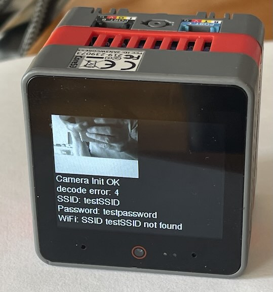

# esp-read-qrcode - read and decode QRcodes via camera, and connect to Wifi

This repo is a QRcode reading demo for the [M5Stack CoreS3](https://docs.m5stack.com/en/core/CoreS3), which has a builtin camera. Once the code is read successfully, the payload is checked for the [WIFI URI](https://superuser.com/questions/1752083/wifi-qr-code-format-for-wpa2-wpa3) format;
If so, the contained SSID and password are used to connect to the access point.

[Generating a WIFI URI Online](https://qifi.org/)

[Specification of the WIFI URI format](https://www.wi-fi.org/system/files/WPA3%20Specification%20v3.2.pdf#page=25)

# Status
Best results: generating a Wifi URI with [qifi.org](https://qifi.org/) and pointing the camera at the screen or printed out on paper (larger images help, a code of 2cm squared performs worse than a 5x5 or 20x20cm code)

Reading works well from an iPhone if this shortcut is used: https://www.youtube.com/watch?v=yl60Vkyg9CM but see below.

While current Android can generate a Wifi QRcode natively, I had less success with this setup as the generated code obviously requires higher camera resolution.

update: increased resolution from QVGA to VGA which substantially improves decoding quality.

# iPhone Shortcut

While the above shortcut displays the WiFi QRcode properly, it shows a small overlay symbol over the code like so:

Unfortunately this makes recognition by the app much harder. However, there's a trick: hit the Edit symbol (bottom right) and
the QRcode is displayed without overlay, which is recognized perfectly:

Maybe there's a way to scale down the image so the overlay symbol doesnt interfere.

# Build

the decoding heavy lifting is done by Daniel Beer's great [quirc](https://github.com/dlbeer/quirc) library which I [slightly modified](https://github.com/mhaberler/quirc.git#mah) to be more in line with small-stacksize embedded platforms. See here for an intro to the [Quirc library](https://www.dlbeer.co.nz/oss/quirc.html).

The code uses the [Pioarduino 3.2rc2 release candidate](https://github.com/pioarduino/platform-espressif32/releases/download/54.03.20-rc2/platform-espressif32.zip) and a [recently patched M5GFX library](https://github.com/m5stack/M5Unified/issues/158).